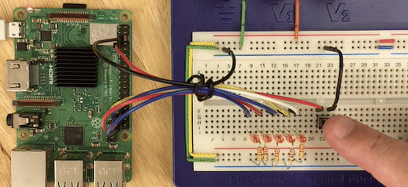

# GPIO class using Linux sysfs.

 >> [source code](test/led5sw1_event.rb) / [schematic](img/led5sw1_schema.png)

## Overview

This is an implementation of the GPIO class library for Linux.
Follows mruby, mruby/c common I/O API guidelines.


## Installation

    $ gem install mruby-sysfs-gpio


## Features

  * Configure the pin as an input or output. (if hardware allows)
  * Has an extension that allows you to define code to be executed when the input changes.


## Usage

about RaspberryPi...

```
# Flash LED a.k.a. ElChika (in japanese)
# Connect Pin #37 (GPIO26) to LED.

require "mruby/gpio"   # or "mruby/gpio/sysfs"

led = GPIO.new(26, GPIO::OUT)
while true
  led.write( 1 )
  sleep 1
  led.write( 0 )
  sleep 1
end
```

Other case, see original guidelines.

https://github.com/mruby/microcontroller-peripheral-interface-guide/blob/main/mruby_io_GPIO_en.md


## Licence

BSD 3-Clause License. see LICENSE file.
